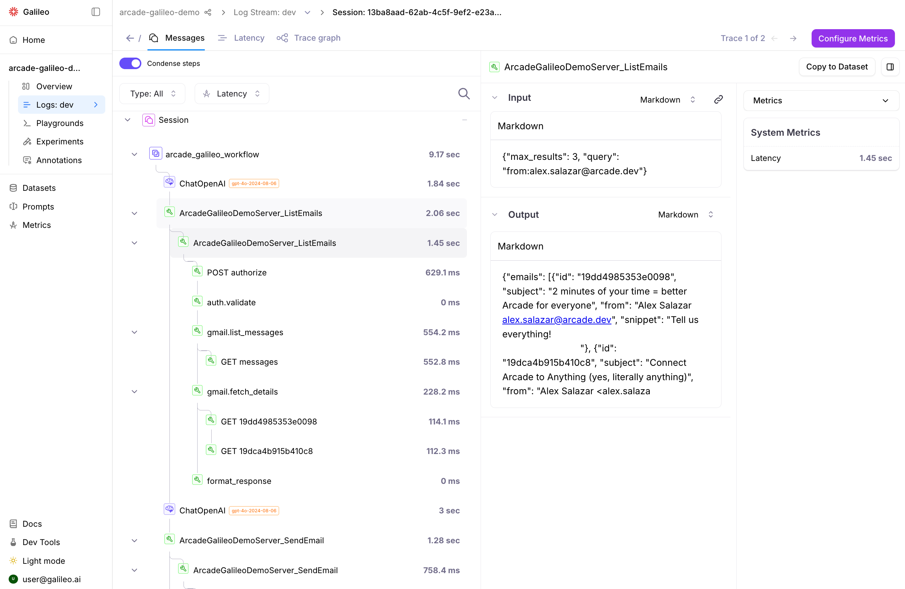

# arcade_galileo_demo

This demo showcases **MCP tool calls against a local Arcade MCP server, with [SEP-2448](https://github.com/modelcontextprotocol/modelcontextprotocol/pull/2448) server-execution telemetry passback stitched into [Galileo](https://rungalileo.io)**. The result is a single Galileo trace where the agent-side LLM and tool calls *and* the server's internal phases (auth checks, Gmail HTTP fan-out, response formatting) hang off the same workflow root — no Galileo SDK in the application code, no Jaeger sidecar.

> **Presenting this demo?** Start with [`docs/running-the-demo.md`](docs/running-the-demo.md) — it's the full runbook with troubleshooting. [`docs/architecture.md`](docs/architecture.md) and [`docs/call-flow.md`](docs/call-flow.md) are the companion explainers.

## source

- https://github.com/ArcadeAI/arcade-mcp/tree/main/examples/mcp_servers/telemetry_passback
- https://github.com/ArcadeAI/arcade-mcp/pull/797
- https://github.com/modelcontextprotocol/modelcontextprotocol/pull/2448
- https://www.loom.com/share/d5c79df7396a48668782b1eb5c415ec6

## What's happening

Three processes, two networks, one trace.

- **`server.py`** — a local Arcade MCP server (built on `arcade-mcp-server`). Two tools: `list_emails`, `send_email`, both Google-OAuth-scoped via Arcade's `@tool(requires_auth=Google(...))`. `TelemetryPassbackMiddleware` intercepts every `tools/call`, reads the agent's `traceparent` from `_meta`, creates a SERVER span under the agent's trace ID, runs the tool (which itself emits phase spans + HTTP child spans), then attaches the resulting `resourceSpans` to the response `_meta.otel.traces`. Listens at `http://127.0.0.1:8000/mcp` with OAuth 2.1 resource-server auth via Arcade Cloud.
- **`workflow.py`** — a LangChain agent that talks to `server.py` over MCP streamable HTTP. The MCP SDK handles OAuth 2.1 against `cloud.arcade.dev` automatically (browser-based PKCE, tokens cached to `.oauth_*.json`). For each `bind_tools` tool call the LLM picks, the agent injects `traceparent` into `_meta`, requests passback (`_meta.otel.traces.request=true`), receives the server's spans inline, and forwards them to Galileo's OTLP endpoint as protobuf — same headers `GalileoSpanProcessor` uses for the agent's own spans, so everything lands in the same project / log stream / trace.
- **`instrumentation.py`** — Galileo OTel boot. Validates env, runs `galileo_context.init(...)`, attaches `galileo.otel.GalileoSpanProcessor` to a standard `TracerProvider`, installs `LangChainInstrumentor` so every `ChatOpenAI` invocation auto-emits OpenInference-shaped spans Galileo renders natively. Also exports `ingest_passback_to_galileo(meta)` — the helper `workflow.py` calls after every MCP tool response.

The point of this demo is the **stitch**: client-side LLM/tool spans (from `LangChainInstrumentor` + manual `ToolSpan`s) and server-side phase spans (from `TelemetryPassbackMiddleware` on the local server) share the same trace ID, hang off the same workflow root, and render in Galileo's UI as one tree.

| File | What it does |
|---|---|
| `server.py` | Local Arcade MCP server. Gmail tools with rich phase spans. `TelemetryPassbackMiddleware` returns spans inline on every `tools/call`. |
| `instrumentation.py` | Side-effecting Galileo OTel setup; exports `tracer` for manual spans + `ingest_passback_to_galileo` for forwarding server spans. |
| `workflow.py` | LangChain agent. Connects to `server.py` over MCP, opts into passback, ingests server spans into Galileo on every tool call. |

## Prereqs

- [`uv`](https://docs.astral.sh/uv/) — Python project/package manager. Install: `brew install uv` or `curl -LsSf https://astral.sh/uv/install.sh | sh`.
- API keys for OpenAI, Arcade, and Galileo (see below).
- A Google account willing to OAuth-authorize Gmail (read + send) for the `ARCADE_USER_ID` you choose.
- The sibling [`arcade-mcp`](https://github.com/ArcadeAI/arcade-mcp) checkout at `../arcade-mcp/` — `pyproject.toml` installs `arcade-mcp-server` editable from there, because `TelemetryPassbackMiddleware` isn't published to PyPI yet.

`uv` handles the Python toolchain, venv, and dependencies. The project requires Python 3.11+; `uv` will fetch it automatically if missing.

### Getting the API keys

**OpenAI** → `OPENAI_API_KEY`

1. Sign up or log in at https://platform.openai.com
2. Add a payment method at https://platform.openai.com/account/billing — new accounts without billing can't call `gpt-4o`.
3. Go to https://platform.openai.com/api-keys → **Create new secret key** → copy the `sk-...` value.

**Arcade** → `ARCADE_API_KEY`

1. Sign up at https://api.arcade.dev/dashboard/register
2. Go to https://api.arcade.dev/dashboard/api-keys → **Create API Key** → copy the `arc_...` value.
3. Note: this key is read by **`server.py`**, not `workflow.py`. The local server uses it to broker Google OAuth for `@tool(requires_auth=Google(...))`. The agent never calls Arcade Cloud directly — its only auth flow is MCP OAuth 2.1 against `cloud.arcade.dev/oauth2`, which is handled by the MCP SDK without a key.

**Galileo** → `GALILEO_API_KEY`

1. Sign up at https://app.galileo.ai/sign-up (or your cluster's console URL).
2. In the console, go to **Settings → API Keys** (https://app.galileo.ai/settings/api-keys).
3. Create a key, copy the value, paste into `.env`.
4. If you're on a non-default cluster (dev / staging / demo-v2 / self-hosted), set `GALILEO_CONSOLE_URL` in `.env` to that cluster's console URL. Both `GalileoSpanProcessor` and the manual passback POST derive the OTLP endpoint from there — no separate endpoint override needed.

## Run it

```bash
cp .env.example .env
# ...then fill in OPENAI_API_KEY, ARCADE_API_KEY, ARCADE_USER_ID,
# GALILEO_API_KEY, GALILEO_PROJECT
# (and GALILEO_CONSOLE_URL if you're on a non-default cluster)

uv sync

# macOS only — clear UF_HIDDEN on the editable .pth files so Python's site.py
# doesn't silently skip them. Required for arcade-mcp-server's editable install.
chflags nohidden .venv/lib/python*/site-packages/_editable_impl_*.pth \
                 .venv/lib/python*/site-packages/_virtualenv.pth
```

> **Use `.venv/bin/python`, not `uv run python`, on macOS.** `uv run` re-applies the `UF_HIDDEN` flag on every invocation, undoing the `chflags` above. Direct invocation of the venv's interpreter doesn't.

You need **two terminals**.

### Terminal 1 — start the local MCP server

```bash
.venv/bin/python server.py
```

The server listens at `http://127.0.0.1:8000/mcp`. Leave it running.

### Terminal 2 — run the agent

```bash
.venv/bin/python workflow.py
```

On first run, the MCP SDK opens a browser for **MCP OAuth** (the agent authenticating itself against the local server, validated against Arcade Cloud). Tokens persist in `.oauth_tokens.json` / `.oauth_client.json` so subsequent runs are non-interactive.

Then, on the *very first* `ArcadeGalileoDemoServer_ListEmails` / `ArcadeGalileoDemoServer_SendEmail` call for a fresh `ARCADE_USER_ID`, the server returns a **Google OAuth** URL instead of email data — open it, complete Google's consent for the relevant scope, press Enter back in the agent terminal, and the call retries.

### CLI flags

```bash
# Top-level phase spans only (default — auth, list, fetch, format)
.venv/bin/python workflow.py

# Full server span tree, including HTTPX child spans under each phase
.venv/bin/python workflow.py --detailed

# Different query
.venv/bin/python workflow.py "List my 5 most recent unread emails"

# Server URL override (default http://127.0.0.1:8000/mcp)
.venv/bin/python workflow.py --server-url http://127.0.0.1:8000/mcp
```

Expected console output (default mode):

```
============================================================
Arcade + Galileo Integration Demo (server-span passback)
============================================================

  Mode:         phases only
  MCP server:   http://127.0.0.1:8000/mcp
  Query:        Find my 3 most recent emails from alex.salazar@arcade.dev. ...

  Server:                       arcade_galileo_demo_server v0.1.0
  serverExecutionTelemetry:     True
  Capability:                   {'version': '2026-03-01', 'signals': {'traces': {'supported': True}}}
  Tools:                        ['ArcadeGalileoDemoServer_ListEmails', 'ArcadeGalileoDemoServer_SendEmail']

Executing workflow...

  Server-side spans: 6 received and forwarded to Galileo
  (3 additional spans available with --detailed)
  Server-side spans: 5 received and forwarded to Galileo
  (1 additional spans available with --detailed)

============================================================
Workflow completed successfully!
============================================================

Result:
I have summarized your 3 most recent emails from Alex Salazar and sent the
summary to your email at <ARCADE_USER_ID>. Let me know if there's anything
else you need!

✓ View this trace at: https://app.galileo.ai/project/<id>/log-streams/<id>
```

> **Why 6 + 5 spans?** Each `tools/call` produces one SERVER root + the tool's phase spans. `list_emails` adds 5 phase spans (auth.validate, gmail.list_messages, gmail.fetch_details, format_response, plus an internal middleware span) on top of the SERVER root = 6 total. `send_email` is one phase shorter (no fetch_details), so 5 total. The `(N additional spans available with --detailed)` lines are the HTTPX child spans the server filtered out.

> **Tool naming.** `arcade-mcp-server` namespaces tool functions by prefixing the server name in CamelCase: `list_emails` → `ArcadeGalileoDemoServer_ListEmails`. The agent's `bind_tools` flow uses these names verbatim — the LLM sees them as plain function names, no transformation needed.

## See the trace in Galileo



Above: a `--detailed` run from the demo as it renders in Galileo. The agent-side `arcade_galileo_workflow` root, `ChatOpenAI` LLM spans, and `ArcadeGalileoDemoServer_ListEmails`/`SendEmail` ToolSpans are all from this process. Everything underneath each ToolSpan — the `auth.validate`, `gmail.list_messages`/`gmail.fetch_details`/`gmail.send_message` phase spans, and the `GET messages` / `GET messages/<id>` HTTP child spans — comes from the local server via SEP-2448 passback. The waterfall under `gmail.fetch_details` (one HTTP child per message) is the kind of internal detail an agent author normally can't see — that's the value proposition.

Open Galileo UI → project `arcade-galileo-demo` → log stream `default`. Open the most recent trace. You should see a tree shaped like:

```
arcade_galileo_workflow                                  (WorkflowSpan, root)
├── ChatOpenAI                                           (OpenInference, auto)
├── ArcadeGalileoDemoServer_ListEmails                   (ToolSpan — agent-side)
│   └── tools/call ArcadeGalileoDemoServer_ListEmails    (SERVER, from passback)
│       ├── auth.validate
│       ├── gmail.list_messages
│       │   └── GET messages                             (only with --detailed)
│       ├── gmail.fetch_details
│       │   ├── GET messages/<id>                        (only with --detailed; one per email)
│       │   └── ...
│       └── format_response
├── ChatOpenAI                                           (round 2)
├── ArcadeGalileoDemoServer_SendEmail                    (ToolSpan)
│   └── tools/call ArcadeGalileoDemoServer_SendEmail     (SERVER)
│       ├── auth.validate
│       ├── gmail.send_message
│       │   └── POST messages/send                       (only with --detailed)
│       └── format_response
└── ChatOpenAI                                           (final)
```

The thing to notice: **everything below `tools/call <toolname>` is server-side**, ingested via SEP-2448 passback. Without this demo's server-side instrumentation those nodes wouldn't exist — the tool call would be a single ~3-second span with no internal structure. That's the value: the consumer can see *why* a tool call took the time it did without access to the server's deployment or code.

See [`docs/call-flow.md`](docs/call-flow.md) for the full sequence diagram and [`docs/architecture.md`](docs/architecture.md) for the trust-boundary breakdown.

## Granularity control: `--detailed`

The default mode returns only top-level phase spans (6 spans per `ArcadeGalileoDemoServer_ListEmails` call: SERVER root + auth + list + fetch + format + an internal middleware span). The `--detailed` flag asks the server's middleware to include the HTTPX child spans too — and importantly, **N HTTP spans under `gmail.fetch_details`** revealing the sequential-fetch waterfall. That's the SEP's filtering knob: the server vendor decides what to expose, the client opts in.

## Swapping the toolkit

The two tools live in `server.py` (`list_emails`, `send_email`). To add a new tool:

1. In `server.py`, define a new function decorated with `@app.tool(requires_auth=...)`. Wrap each logical phase in `tracer.start_as_current_span(...)` so it shows up in the passback.
2. In `workflow.py`, no changes needed — the agent discovers tools dynamically via `session.list_tools()` and binds them all.

For new auth providers, swap `Google(scopes=[...])` for `Slack(...)`, `GitHub(...)`, etc. (see `arcade_mcp_server.auth`). No-auth tools (math, search) skip the OAuth dance entirely.

## What about *Arcade Cloud*-hosted tools?

This demo runs the MCP server **locally** so it can demonstrate server-side passback under a single trace. If you want the older "agent calls Arcade Cloud, observes only the client-side surface in Galileo" story (no server passback, opaque tool calls), check the previous version of this repo's `arcadepy` + `arcade.tools.execute(...)` flow in git history — that's a different demo with a different trace shape (no `tools/call <toolname>` SERVER span, no internal phases visible).
