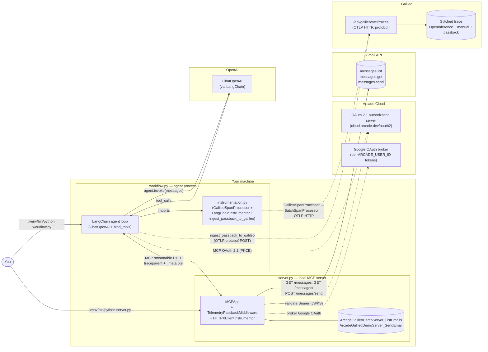

# Architecture

## One-sentence summary

A **local Arcade MCP server** runs Gmail tools instrumented with `TelemetryPassbackMiddleware`. A LangChain **agent** connects over MCP streamable HTTP, requests server-execution telemetry on every `tools/call`, receives the server's internal spans inline (under `_meta.otel.traces.resourceSpans`), and forwards them — together with its own LLM and tool spans — to **Galileo via standard OTLP**, producing a single stitched client+server trace.

## Big picture



**Solid arrows**: data-path (request/response, function calls).
**Dashed arrows**: telemetry side-channel and OAuth flows.

## The five pieces

### 1. `server.py` — the local Arcade MCP server

This is the new piece (vs. the old `arcadepy`-based demo). It runs an Arcade `MCPApp` with two tool functions (defined in code as `list_emails` and `send_email`; published over MCP as `ArcadeGalileoDemoServer_ListEmails` and `ArcadeGalileoDemoServer_SendEmail` because `arcade-mcp-server` prefixes every tool with the CamelCased server name) and the `TelemetryPassbackMiddleware`. On every `tools/call` request:

1. The middleware reads `_meta.traceparent` (the agent's trace context) and `_meta.otel.traces.{request, detailed}` (passback opt-in flags).
2. It opens a SERVER-kind span under the agent's trace, so the parent linkage stitches automatically.
3. The tool function runs. Each logical phase (auth check, Gmail list, Gmail per-message fetch, response formatting) is wrapped in `tracer.start_as_current_span(...)` with `gen_ai.*` semantic-convention attributes. `HTTPXClientInstrumentor` adds child spans for every `httpx` HTTP call.
4. After the tool returns, the middleware pulls all spans created during the request out of its in-memory buffer, serializes them to OTLP JSON, and attaches them to `response._meta.otel.traces.resourceSpans` (and `truncated` / `droppedSpanCount` if the agent didn't ask for `--detailed` and child spans were filtered out).

`ResourceServerAuth` validates Bearer tokens against `cloud.arcade.dev/oauth2`'s JWKS (RFC 9728 OAuth 2.1). The `ArcadeResourceServerAuth` subclass swaps `user_id` to the JWT's `email` claim so Arcade's Google OAuth broker matches the right user when `@tool(requires_auth=Google(...))` runs.

The server has its own `TracerProvider` but **no external exporter** — spans live inside the middleware's ring buffer and ride back to the agent inline. There is no separate "server-side telemetry path" to configure on a vendor's deployment, only on the agent.

### 2. `workflow.py` — the LangChain agent

A multi-round `for` loop bound by `MAX_WORKFLOW_ROUNDS = 5`:

```python
workflow = WorkflowSpan(name="arcade_galileo_workflow", input=user_query)
with otel.start_galileo_span(workflow):
    for round_num in range(1, MAX_WORKFLOW_ROUNDS + 1):
        ai_message = await llm.ainvoke(messages)
        if not ai_message.tool_calls:
            break
        for tc in ai_message.tool_calls:
            tool = ToolSpan(name=tc["name"], input=..., tool_call_id=tc["id"])
            with otel.start_galileo_span(tool):
                propagator.inject(carrier)
                meta = {
                    "traceparent": carrier["traceparent"],
                    "otel": {"traces": {"request": True, "detailed": detailed}},
                }
                result = await session.call_tool(tc["name"], arguments=tc["args"], meta=meta)
                ingest_passback_to_galileo(result.meta)
            messages.append({"role": "tool", "tool_call_id": tc["id"], "content": result})
```

Two things to notice:

- The `ToolSpan` is *typed* (Galileo's `ToolSpan` schema) and started via `otel.start_galileo_span` — Galileo renders this with the green Tool icon. The reference impl uses a generic `tracer.start_as_current_span("mcp.call_tool ...")` because Jaeger doesn't care about typing.
- The `traceparent` injected into `_meta` is the active OTel context's W3C trace-context header. Because the active span is the `ToolSpan`, the server creates its `tools/call <toolname>` SERVER span as a *child of the `ToolSpan`* — that's how the stitch works without any Galileo-specific glue.

The MCP OAuth flow (agent → local server) is handled entirely by the MCP SDK via `OAuthClientProvider` + a `FileTokenStorage` that persists tokens between runs.

### 3. `instrumentation.py` — the Galileo OTel boot

Side-effecting on import. Same pattern as the previous version of this demo, with one addition:

- `GalileoSpanProcessor` wraps the OTLP exporter, derives the endpoint from `GALILEO_CONSOLE_URL`, and injects `Galileo-API-Key` / `project` / `logstream` headers — for spans this process emits.
- `LangChainInstrumentor().instrument(tracer_provider=...)` patches LangChain so `ChatOpenAI` invocations auto-emit OpenInference-shaped spans.
- **NEW** — `ingest_passback_to_galileo(meta)` replicates the same routing for spans we *receive* (from the server's passback). It re-derives the OTLP endpoint from `GALILEO_CONSOLE_URL`, builds the same `Galileo-API-Key` / `project` / `logstream` headers, encodes the OTLP JSON `resourceSpans` as protobuf, and POSTs. Result: passback spans land at the same Galileo destination as the agent's own spans, in the same project / log stream / trace.

The choice to put `ingest_passback_to_galileo` here (rather than in `workflow.py`) is deliberate: the helper needs the same `GALILEO_CONSOLE_URL` / `GALILEO_API_KEY` config that the processor uses, and the `instrumentation` module already owns that config.

### 4. OpenAI (via LangChain) — the decider

Standard `ChatOpenAI(model="gpt-4o", temperature=0.7).bind_tools(openai_tools)`. We discover MCP tools via `session.list_tools()` and convert their JSON-Schema input shapes to OpenAI function-calling format with `_mcp_to_openai_tool()`. The LLM never sees that the tools come from MCP — it sees standard OpenAI function defs and emits `tool_calls`.

Any function-calling-capable LangChain chat model works (`ChatAnthropic`, `ChatVertexAI`, etc.) — the OpenInference instrumentor is provider-agnostic.

### 5. Galileo — wired via `GalileoSpanProcessor` + manual passback POST

Two paths land in the same place:

| Path | What it carries | How it gets there |
|---|---|---|
| `GalileoSpanProcessor` | Agent-emitted spans: `WorkflowSpan`, `ToolSpan`, `ChatOpenAI` (OpenInference) | `BatchSpanProcessor` → `OTLPSpanExporter` (protobuf) → cluster URL derived from `GALILEO_CONSOLE_URL` |
| `ingest_passback_to_galileo` | Server-passback spans: `tools/call <toolname>` SERVER span + phase spans + (optionally) HTTP child spans | Synchronous `httpx.post(<console>/api/galileo/otel/traces, content=protobuf, headers=...)` per tool call |

Both share the **same trace ID** (because the server's SERVER span was created from the agent's `traceparent`), so Galileo joins them into one tree on ingest. Routing headers on both paths:

| Header | Purpose |
|---|---|
| `Galileo-API-Key` | Tenant authentication |
| `project` | Routes traces to the project (must match `GALILEO_PROJECT`) |
| `logstream` | Routes traces to a log stream within the project (defaults to `default`) |

To target a non-default cluster, set `GALILEO_CONSOLE_URL` in `.env`. Both paths derive the OTLP endpoint from it. To target a non-Galileo OTLP backend (Jaeger, Honeycomb, etc.), you'd swap `GalileoSpanProcessor` for a vanilla processor *and* update `ingest_passback_to_galileo` to point at the same destination.

## Trust boundaries and data flow

| Leaves your machine to… | Contains |
|---|---|
| OpenAI | The user prompt, the MCP-derived tool schemas, message history, tool results |
| Arcade Cloud (OAuth) | OAuth authorization-code requests; JWT validation traffic from `server.py` |
| Arcade Cloud (Google OAuth broker) | The `requires_auth=Google(...)` flow's redirect through Arcade's Google OAuth integration |
| Gmail (Google) | Bearer-token-authenticated reads of message metadata + sends |
| Galileo | The full stitched trace: workflow root, `ChatOpenAI` spans (`llm.input_messages` / `llm.output_messages` / token counts), `ToolSpan` input/output (capped at 5000 chars), `tools/call` SERVER span, phase spans, optional HTTP child spans with method + URL + status |

If you're demoing with real email content, be aware that LLM input/output messages get logged to Galileo (and OpenAI) and Gmail metadata (subjects, snippets, sender addresses) ends up on the wire to Galileo via the `format_response` and `gmail.fetch_details` spans. Use a throwaway Gmail account for live demos with sensitive audiences.

## Design non-choices (preserve these)

- **Local MCP server, not Arcade Cloud.** The whole demo turns on server-side instrumentation under the agent's trace. Cloud-hosted tools can't pass back spans we control.
- **OTLP transport, not the Galileo Python SDK chat-client wrapper.** Don't reintroduce `from galileo.openai import OpenAI` or `galileo.log` decorators.
- **`OpenInferenceInstrumentor`, not Traceloop's `LangchainInstrumentor`.** Galileo renders OpenInference attributes natively. Traceloop's schema would still ship spans but lose the LLM input/output rendering.
- **Side-effecting `instrumentation` import.** Do not refactor the OTel setup into an `init()` function unless `workflow.py` calls it explicitly *before* importing or constructing any LangChain component.
- **Manual workflow root + typed `ToolSpan`.** OpenInference produces one span per `ChatOpenAI` invocation but no parent — the manual `WorkflowSpan` is what gives Galileo a single root, and `ToolSpan` (typed) renders the tool calls properly.

## What this demo replaces

The previous version of this demo used `arcadepy.tools.execute(...)` to call Arcade Cloud-hosted tools, observed only the client-side surface (LLM spans + tool input/output as strings, no internal phases), and explicitly punted on SEP-2448 with a "that's a sibling demo" non-choice. **That non-choice is now inverted.** Server-side passback is the reason this demo exists.

If a customer specifically wants the older "client-only, opaque tool calls" story, they should use the previous version of this repo (preserved in git history) or a vanilla `arcadepy` snippet — those don't require running a local server, but they also don't show the inside of a tool call.
