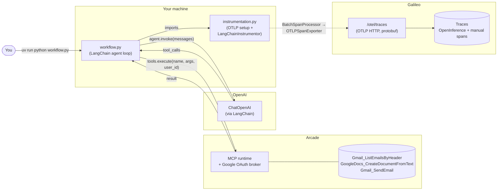

# Architecture

## One-sentence summary

A LangChain agent calls an LLM (OpenAI), lets it pick from three Arcade tools (Gmail + Google Docs), executes them through **Arcade** (which speaks MCP under the hood and handles Google OAuth), and ships the whole trace — LLM calls + tool executions — to **Galileo via standard OTLP**, with no Galileo SDK in the application code.

## Big picture



**Solid arrows**: data flow in the request/response path.
**Dashed arrow**: telemetry side-channel (OpenTelemetry batches spans and ships them to Galileo's OTLP endpoint asynchronously).

## The five pieces

### 1. `instrumentation.py` — the OTel boot

Side-effecting module. Importing it is what installs everything:

- Reads `GALILEO_API_KEY`, `GALILEO_PROJECT`, `GALILEO_LOG_STREAM` from env (and `GALILEO_CONSOLE_URL` if set, for non-default clusters).
- Calls `galileo_context.init(project=..., log_stream=...)` — bootstraps the project + log stream and authenticates against the cluster derived from `GALILEO_CONSOLE_URL` (default SaaS if unset).
- Builds a `Resource(service.name="arcade-galileo-demo", service.version="1.0.0")`.
- Registers a `TracerProvider`, then attaches `galileo.otel.GalileoSpanProcessor(project=..., logstream=...)` via `otel.add_galileo_span_processor(provider, processor)`. The processor wraps the OTLP exporter, derives the endpoint from the resolved console URL, and injects routing headers — none of that lives in app code.
- Calls `LangChainInstrumentor().instrument(tracer_provider=...)` so future `ChatOpenAI` invocations auto-emit OpenInference-shaped spans.
- Exports `tracer = trace.get_tracer(__name__)` for manual spans.

The choice to put this in a separate side-effecting module is deliberate: the LangChain instrumentor must be installed *before* any `ChatOpenAI` is constructed, otherwise the patch happens too late and no LLM spans are produced. Putting `from instrumentation import tracer` at the top of `workflow.py` enforces that ordering.

Pattern reference: this mirrors the canonical Galileo OTel integration shown in the `galileo-test/agents/10_otel_openinference.ipynb` notebook — the `LangChainInstrumentor` here replaces the notebook's `OpenAIInstrumentor`, but the `GalileoSpanProcessor` setup is identical.

### 2. `workflow.py` — the agent loop

A multi-round `for` loop bound by `MAX_WORKFLOW_ROUNDS = 5`:

```python
for round_num in range(1, MAX_WORKFLOW_ROUNDS + 1):
    ai_message = agent.invoke(messages)
    messages.append(ai_message)
    if not ai_message.tool_calls:
        return ai_message.content     # final answer
    for tc in ai_message.tool_calls:
        with tracer.start_as_current_span(f"arcade.execute.{tc['name']}"):
            result = arcade.tools.execute(tool_name=tc["name"], input=tc["args"], user_id=...)
        messages.append({"role": "tool", "tool_call_id": tc["id"], "content": ...})
```

The whole loop is wrapped in `tracer.start_as_current_span("arcade_galileo_workflow")`. Together with the auto-instrumented `ChatOpenAI` spans and the manual `arcade.execute.*` spans, this produces a full agent trace in Galileo with no SDK-specific glue.

### 3. OpenAI (via LangChain) — the decider

Standard `langchain_openai.ChatOpenAI(model="gpt-4o", temperature=0.7).bind_tools(arcade_tools)`. The LLM receives the user prompt and the OpenAI-formatted tool schemas Arcade ships, and decides whether to answer directly or emit `tool_calls`. We use `gpt-4o` for tool-use reliability; any function-calling-capable LangChain chat model works (`ChatAnthropic`, `ChatVertexAI`, etc.) — the OpenInference instrumentor is provider-agnostic.

### 4. Arcade — the tool runtime

Arcade is both an **MCP runtime** (it implements the Model Context Protocol server-side for thousands of tools) and an **OAuth broker** (it handles Google OAuth for Gmail/Docs, scoped per `ARCADE_USER_ID`). The demo talks to Arcade through `arcadepy` — `arcade.tools.execute(...)` is an MCP call under the hood.

The demo uses three tools chosen to exercise a realistic agent loop: list emails (read scope), summarize them, create a doc (write scope), and email back the link.

### 5. Galileo — wired via `GalileoSpanProcessor`

`galileo.otel.GalileoSpanProcessor` is the supported integration surface. From the agent's perspective:

- `galileo_context.init(project=..., log_stream=...)` resolves the cluster URL from `GALILEO_CONSOLE_URL` (default SaaS if unset), authenticates with `GALILEO_API_KEY`, and confirms the project/log-stream exist (creating them if your tenant allows auto-create).
- `GalileoSpanProcessor(project=..., logstream=...)` is added to the `TracerProvider` and handles, internally: constructing the OTLP exporter for the right cluster URL, attaching the `Galileo-API-Key` / `project` / `logstream` routing headers, and batching/flushing.

Routing headers (set on the wire by the processor; you don't construct them in app code):

| Header | Purpose |
|---|---|
| `Galileo-API-Key` | Tenant authentication |
| `project` | Routes traces to the project (must match `GALILEO_PROJECT`) |
| `logstream` | Routes traces to a log stream within the project (defaults to `default`) |

To target a non-default cluster, set `GALILEO_CONSOLE_URL` in `.env` (e.g. `https://console.demo-v2.galileocloud.io/`). The processor handles the rest. To target a non-Galileo OTLP backend (Jaeger, Honeycomb, etc.), you'd swap `GalileoSpanProcessor` for a vanilla `BatchSpanProcessor(OTLPSpanExporter(endpoint=..., headers=...))` — that's a different demo.

## Trust boundaries and data flow

| Leaves your machine to… | Contains |
|---|---|
| OpenAI | The user prompt, the Arcade-provided tool schemas, message history, tool results |
| Arcade | The tool name + arguments the LLM chose, your `ARCADE_USER_ID`. Google OAuth flows redirect through Arcade. |
| Galileo | The full trace: span tree, `llm.input_messages` / `llm.output_messages`, token counts, `arcade.tool.args` / `arcade.tool.result` (truncated to 500 chars per span) |

If you're demoing with real email content, be aware that LLM input/output messages get logged to Galileo (and OpenAI). Use a throwaway Gmail account for live demos with sensitive audiences.

## Design non-choices (preserve these)

- **OTLP transport, not the Galileo Python SDK.** This is the demo's whole point. Do not reintroduce `from galileo.openai import OpenAI` or `galileo.log` decorators. If a customer asks "can we use the Galileo SDK instead?" — that's a different demo (the previous version of this repo).
- **`arcadepy` SDK, not raw MCP.** Arcade *is* the MCP runtime. If a customer asks for SEP-2448 server-side span passback, that's a sibling demo (`ArcadeAI/arcade-mcp` PR #797), not a rewrite of `workflow.py`.
- **Side-effecting `instrumentation` import.** Do not refactor the OTel setup into an `init()` function unless `workflow.py` calls it explicitly *before* importing or constructing any LangChain component.
- **Manual workflow root span.** OpenInference produces one span per `ChatOpenAI` invocation but no parent — the manual `arcade_galileo_workflow` span is what gives Galileo a single root to anchor the agent trajectory.

## What the demo does NOT show

This is a **client-side** observability story. Server-side Arcade execution (auth checks, middleware decisions, elicitation flows, tool reduction) is *not* visible — those happen behind the MCP boundary and would require either:

- SEP-2448 `serverExecutionTelemetry` span passback (reference impl: `ArcadeAI/arcade-mcp` PR #797).
- A future Arcade dashboard feature for direct OTLP egress to a customer-supplied collector.

When demoing, foreground "OpenInference auto-instrumented LLM spans + manual workflow root + Arcade tool I/O" — that's what's in the trace. Don't claim Arcade-internal stages are visible; they aren't.
