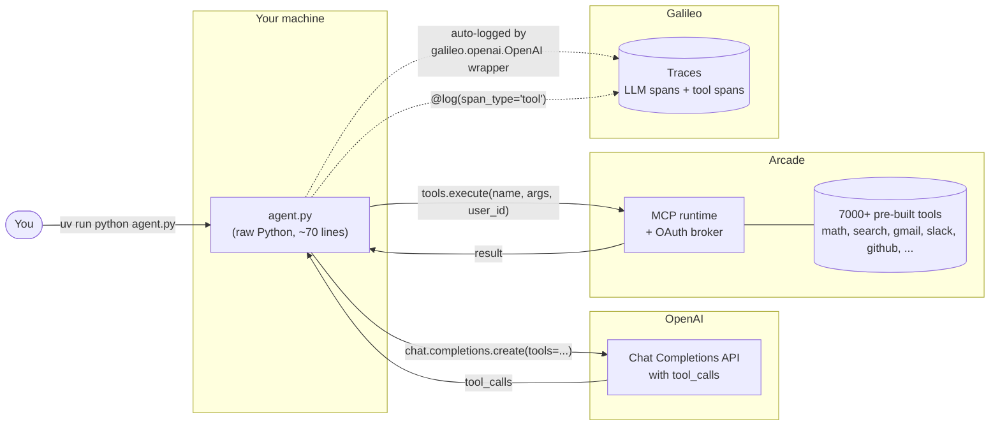

# Architecture

## One-sentence summary

A plain-Python agent calls an LLM (OpenAI), lets the LLM decide which tool to invoke, executes that tool through **Arcade** (which speaks MCP under the hood and handles any required OAuth), and ships the whole trace — LLM call + tool execution — to **Galileo** for observability.

## Big picture

**Solid arrows**: data flow in the request/response path.
**Dashed arrows**: telemetry side-channel (doesn't affect the agent's behavior; traces are batched and flushed on exit).

## The four pieces

### 1. `agent.py` — the glue

A single file, ~70 lines, no agent framework. It does three things:

1. Initializes Galileo context and the Galileo-wrapped OpenAI client.
2. Asks Arcade for a toolkit's tools, pre-formatted for OpenAI function-calling.
3. Runs a `while True` loop over `chat.completions.create(tools=...)` and `tool_calls`, routing every tool call through Arcade.

Deliberately no LangChain / LangGraph / CrewAI / OpenAI Agents SDK. Readers can lift this loop into any framework without translation.

### 2. OpenAI — the decider

Standard Chat Completions API with function-calling. The LLM sees the prompt and a list of Arcade-provided tools, and decides whether to answer directly or call a tool. We use `gpt-4o-mini` for speed; any function-calling-capable OpenAI model works.

### 3. Arcade — the tool runtime

Arcade is both an **MCP runtime** (it implements the Model Context Protocol server-side for thousands of tools) and an **auth broker** (it handles OAuth for services like Gmail, Slack, GitHub, cached per `user_id`). The demo talks to Arcade through `arcadepy`, Arcade's Python SDK — which is the ergonomic surface over MCP. `arcade.tools.execute(...)` is an MCP call under the hood; you don't need to open a raw MCP client yourself.

**Why the SDK instead of a raw MCP client?** Two reasons:
- For a Python agent, the SDK is what Arcade recommends and what ~all the examples use.
- The SDK gives you `formatted.list(format="openai", ...)` — tools pre-shaped for whatever LLM provider you use. Skipping the manual JSON-schema conversion shaves 20 lines of glue.

If you specifically need to show raw MCP, that's a second sibling script — not a rewrite of `agent.py`.

### 4. Galileo — the observability layer

Galileo captures the LLM+tool trace. Integration is two lines of code:

- `from galileo.openai import OpenAI` — a drop-in replacement for `openai.OpenAI` that auto-logs every `chat.completions.create(...)` as an **LLM span**.
- `@log(span_type="tool")` — a decorator on the Arcade-calling helper that auto-logs each invocation as a **tool span** in the same trace.

The tool span captures input args and output, and Galileo links tool spans to the LLM call that requested them via `tool_call_id`. That's how the UI can show you the full agent trajectory, not just a flat list of events.

## Trust boundaries and data flow

| Leaves your machine to… | Contains |
|---|---|
| OpenAI | The prompt, tool schemas (from Arcade), tool results (from Arcade), message history |
| Arcade | Tool name + arguments that the LLM chose, `user_id` (for OAuth scoping) |
| Galileo | Full trace: prompt, LLM output, tool calls and results, timing, token counts |

Nothing stays local-only. If you're demoing with real data, make sure the customer is OK with the prompts/tool results going to all three providers.

## Design non-choices (preserve these)

- **No agent framework.** Keeps the portability story intact. If someone asks "can we do this in LangChain?" — yes, trivially; that's a different script.
- **`arcadepy` SDK, not raw MCP.** The SDK *is* the MCP path for Arcade. Rewriting to use a generic MCP client ships the same bytes over the wire but loses Arcade's tool-schema formatting helpers.
- **Module-level Galileo + Arcade init.** Not inside `main()`. The Galileo OpenAI wrapper patches at construction time; having `galileo_context.init(...)` + `OpenAI()` at module load mirrors the "boot once" pattern every adopter already knows.
- **`try/finally: galileo_context.flush()`.** Galileo batches spans; without flush, a crash or fast exit drops recent spans. The `finally` clause means even exceptions produce a partial trace to debug from.
