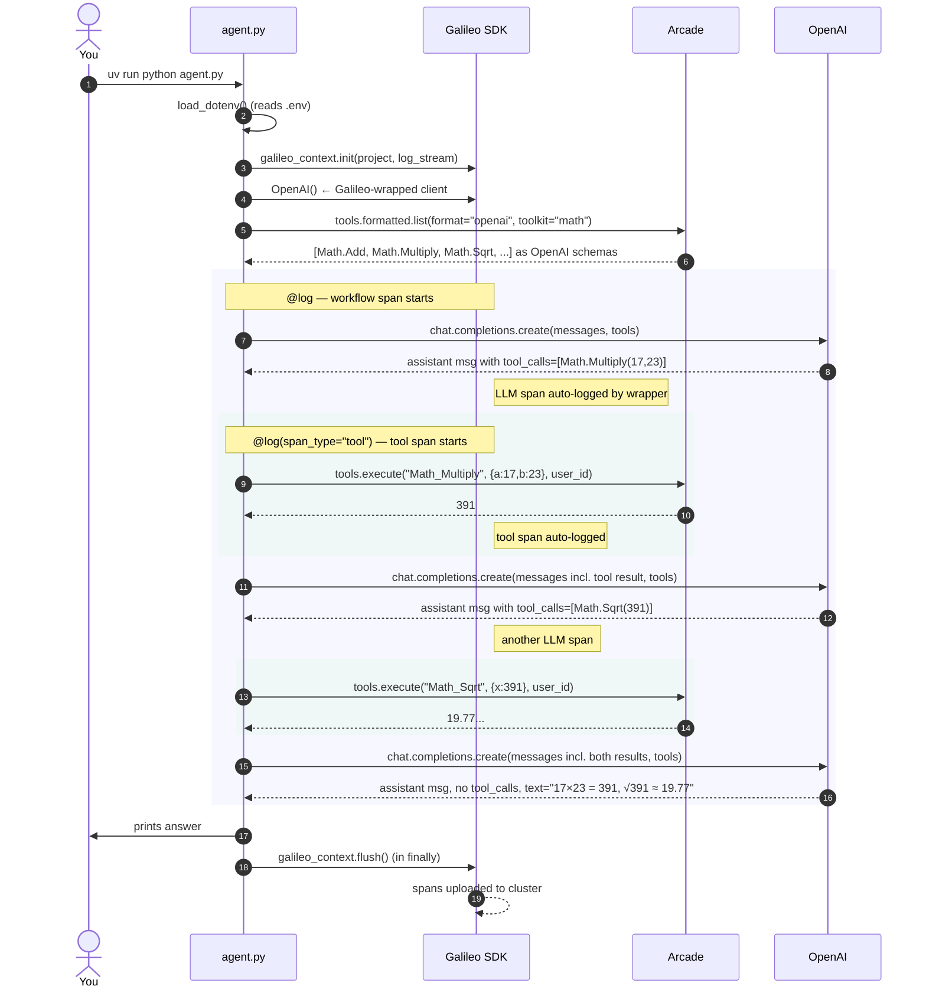

# Call flow

What actually happens, in order, when you run `uv run python agent.py` with the default `math` toolkit and prompt `"What is 17 * 23, then take the square root of that result? Use tools."`

## Sequence diagram



## Step-by-step

**1. Env + SDK init (module load, before `main()`)**

- `load_dotenv()` pulls `.env` into `os.environ`.
- `galileo_context.init(project=..., log_stream=...)` creates a context that the wrapper and `@log` decorator will attach spans to. Also reads `GALILEO_API_KEY` and `GALILEO_CONSOLE_URL` from env — the latter is what sends traces to the demov2 cluster instead of the default SaaS.
- `llm = OpenAI()` — this is the Galileo wrapper, not `openai.OpenAI`. Construction patches it for autologging.
- `arcade = Arcade()` — reads `ARCADE_API_KEY` from env.

**2. Tool discovery**

- `list(arcade.tools.formatted.list(format="openai", toolkit="math"))` returns a list of tool definitions already shaped as `{"type": "function", "function": {"name": ..., "description": ..., "parameters": {...}}}`. This is the shape `chat.completions.create(tools=...)` expects. No manual conversion.
- Iterating the pager (rather than accessing `.items`) handles multi-page toolkits. The `math` toolkit fits in one page, but `google` or `slack` might not.

**3. Agent loop**

A classic OpenAI function-calling loop:

```python
while True:
    resp = llm.chat.completions.create(model=..., messages=messages, tools=tools)
    msg = resp.choices[0].message
    messages.append(msg)
    if not msg.tool_calls:          # LLM produced a final answer
        print(msg.content); return
    for tc in msg.tool_calls:
        output = run_arcade_tool(tc.function.name, json.loads(tc.function.arguments))
        messages.append({"role": "tool", "tool_call_id": tc.id, "content": output})
```

For the math prompt, the loop typically runs **three** `chat.completions.create` calls: one to pick `Math_Multiply`, one to pick `Math_Sqrt`, one to produce the final natural-language answer. Two tool executions happen in between.

**4. Tool execution through Arcade**

```python
@log(span_type="tool")
def run_arcade_tool(tool_name, tool_args):
    result = arcade.tools.execute(tool_name=tool_name, input=tool_args, user_id=USER_ID)
    if result.status == "failed":
        return f"ERROR: {result.output.error if result.output else 'unknown'}"
    return json.dumps(result.output.value) if result.output else ""
```

- Arcade returns errors as `result.status == "failed"`, not Python exceptions. Returning the error as the tool output lets the LLM react (retry with different args, apologize, pick a different tool) instead of crashing.
- `@log(span_type="tool")` captures `tool_name` and `tool_args` as the span's input and the return value as its output. The decorator ties this span to the active trace started by the outer `@log` on `main()`.

**5. Flush on exit**

```python
try:
    main()
finally:
    galileo_context.flush()
```

Galileo buffers spans locally and batches uploads. Without `flush()`, a fast-exiting script can return before the spans leave your machine. The `finally` placement means even a crash still ships whatever was captured.

## What the Galileo trace looks like

In the Galileo UI, under project `arcade-galileo-demo` / log stream `dev`, one invocation of `agent.py` produces **one trace** shaped like:

```
workflow: main                                    (outer @log)
├── llm: OpenAI Chat Completions                  (1st chat.completions call)
│   input:  [{"role":"user","content":"What is 17 * 23, ..."}]
│   output: assistant msg with tool_calls=[Math_Multiply(17,23)]
│   tokens, model, latency auto-captured
├── tool: run_arcade_tool                          (1st Arcade call)
│   input:  {"tool_name":"Math_Multiply","tool_args":{"a":17,"b":23}}
│   output: "391"
├── llm: OpenAI Chat Completions                  (2nd call, with 1st tool result in messages)
│   output: assistant msg with tool_calls=[Math_Sqrt(391)]
├── tool: run_arcade_tool                          (2nd Arcade call)
│   input:  {"tool_name":"Math_Sqrt","tool_args":{"x":391}}
│   output: "19.773"
└── llm: OpenAI Chat Completions                  (3rd call, final answer)
    output: assistant msg, no tool_calls, natural-language answer
```

**What to point at during a live demo:**

- The **workflow root** shows end-to-end latency and total tokens for the whole agent run.
- The **LLM spans** show the exact prompts and responses — including the `tool_calls` field that proves the LLM chose the tools itself.
- The **tool spans** show what actually ran on Arcade, with inputs and outputs. Click one; compare its `input` to the preceding LLM span's `tool_calls[0].function.arguments` — they match. That's the `tool_call_id` link Galileo uses to thread the trace.

## Pitfalls the trace helps you catch

- **Tool hallucination**: LLM invents a tool name that doesn't exist → Arcade returns `failed` → tool span shows the error in the output → you can see the LLM's response to the error in the next LLM span.
- **Argument-shape drift**: LLM passes `{"a":"17","b":"23"}` (strings) when Arcade expects ints → tool span's input shows the bad types.
- **Silent OAuth stall** (when you swap to an authenticated toolkit): first execute returns an authorization URL instead of the real output → tool span output is the URL string, and the loop's next LLM span shows the model "responding" to the URL instead of a real result.

All three failure modes are visually obvious in the Galileo trace before you even re-read the agent code.
