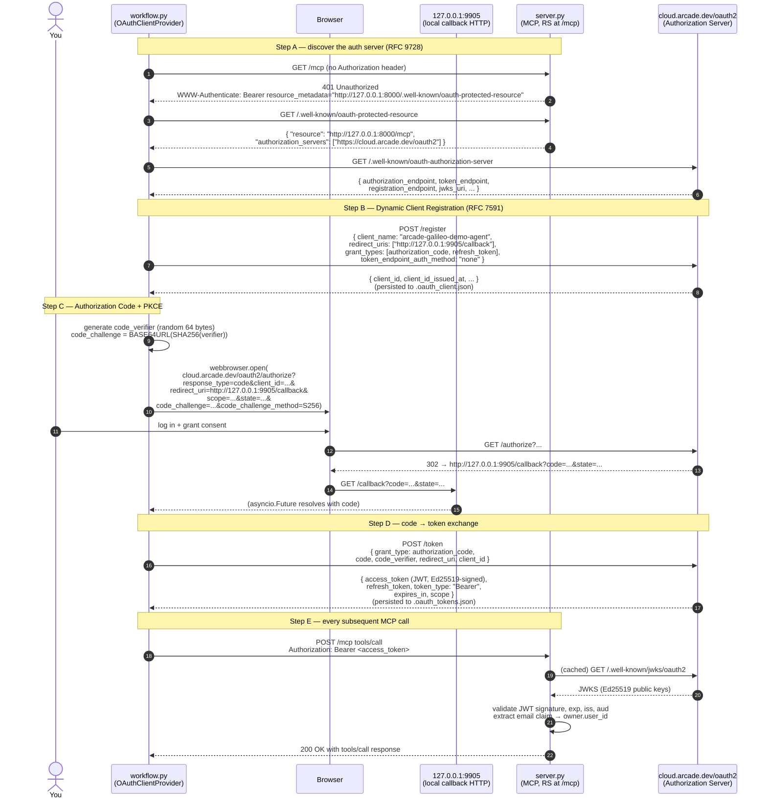
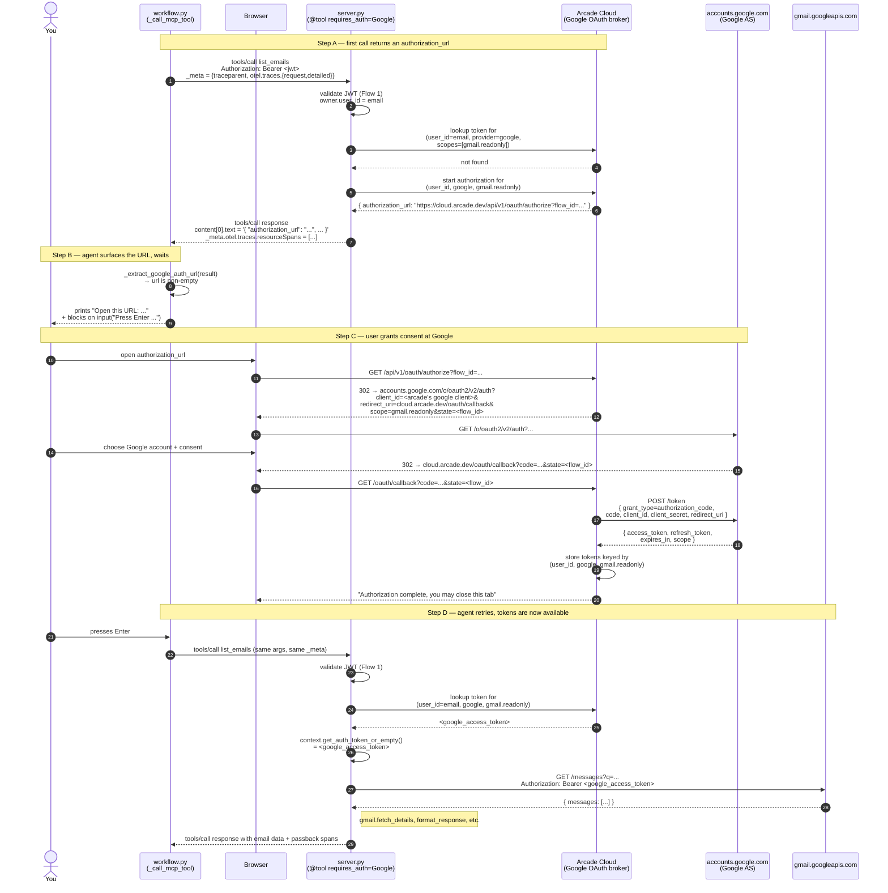

# OAuth flows

This demo runs **two distinct OAuth flows** that are easy to conflate. Understanding what is sent, what is received, and why at each step is what lets you reason about failure modes (token cache stale, scope missing, browser callback blocked, JWT signature invalid).

## TL;DR — why two flows

| Flow | Who it authorizes | Who holds the token | Why it exists |
|---|---|---|---|
| **MCP OAuth 2.1 (PKCE)** | The agent (`workflow.py`) to call the local MCP server (`server.py`) | Agent process — cached to `.oauth_tokens.json` | The MCP server is a protected OAuth 2.1 *resource server*. It needs to know **who the caller is** before running a tool. |
| **Google OAuth (brokered by Arcade)** | The server (`server.py`) to call Gmail API **on behalf of the authenticated user** | Arcade Cloud — keyed by `(user_id=email, provider=google, scopes)` | Tools declared with `@tool(requires_auth=Google(...))` need a Google access token. Arcade brokers consent and persistence so the server doesn't manage Google OAuth itself. |

The two flows **chain together** through one piece of state: the JWT's `email` claim. MCP OAuth produces a JWT whose `email` claim is the user's identity; `ArcadeResourceServerAuth` swaps that into `owner.user_id`; that `user_id` becomes the lookup key into Arcade's per-user Google token store. Without this linkage, the Google broker wouldn't know which user's tokens to use.

## Flow 1 — MCP OAuth 2.1 (agent ↔ Arcade Cloud ↔ local server)

This happens **once per fresh `.oauth_*.json`**. After that, the agent reuses cached tokens (with refresh) and the flow is silent.



### What is in the JWT (`access_token`)

The Bearer token returned by `/token` is a JWT. The relevant claims for this demo:

| Claim | What | Why this demo cares |
|---|---|---|
| `iss` | `https://cloud.arcade.dev/oauth2` | `ResourceServerAuth` checks issuer match |
| `aud` | `urn:arcade:mcp` (in this demo's local-mode setup; see "Audience handling" below) | `ResourceServerAuth` checks `aud` ∈ `expected_audiences` — would normally narrow to a per-resource URL via RFC 8707 audience binding, but localhost can't be back-channel-validated by Arcade so this demo accepts Arcade's generic URN instead |
| `exp` | Expiry timestamp | Validator rejects expired tokens; agent uses the refresh token to get a fresh one |
| `sub` | UUID — the AS's internal user ID | **Not used here.** The default `JWKSTokenValidator` would put this in `owner.user_id`, but Arcade's Google broker indexes by email |
| `email` | The user's email (from Arcade login) | `ArcadeResourceServerAuth.validate_token` overrides `owner.user_id = email` so step (8) of the Google flow finds the right token |
| `scope` | OAuth 2.0 scopes | Set by Arcade; `ResourceServerAuth` does not currently scope-check tool calls |
| `client_id` | UUID from dynamic registration | Identifies which OAuth client (agent) requested the token |

### Audience handling — the localhost workaround

RFC 8707 (Resource Indicators for OAuth 2.0) defines a tighter audience-binding flow: the client sends `resource=<url>` on `/authorize` and `/token`, the auth server stamps `aud=<url>` on the issued token, and the resource server validates `aud == <url>`. That's what would happen by default with the MCP SDK + Arcade.

**This demo can't use the default flow because the resource server is on `127.0.0.1`.** When Arcade's authorization server receives `resource=http://127.0.0.1:8000/mcp`, it performs a back-channel HTTP fetch of the resource's PRM endpoint (`http://127.0.0.1:8000/.well-known/oauth-protected-resource/mcp`) to validate the resource. That request goes from `cloud.arcade.dev` → `localhost`, which is unreachable. Arcade returns `OAuth error: server_error | description: Could not retrieve protected resource metadata for the gateway`.

**The workaround is a coordinated two-side change**:

| Side | Change | Effect |
|---|---|---|
| `workflow.py` | Monkey-patch `OAuthContext.should_include_resource_param` to return `False` | The SDK omits `resource=` from `/authorize` and `/token` requests. Arcade has no resource to validate, so it skips the back-channel fetch and proceeds with normal token issuance. |
| `server.py` | Set `expected_audiences=[CANONICAL_URL, "urn:arcade:mcp"]` | When `resource=` isn't sent, Arcade defaults `aud="urn:arcade:mcp"` on the issued token. The local server accepts both this URN and the canonical URL, so tokens validate either way. |

For a publicly-deployed server (e.g., `server.py` exposed via ngrok / cloudflared / a real production URL), revert both changes — Arcade can then back-channel-fetch the public PRM endpoint, and the proper RFC 8707 audience binding takes over. The two sides are paired: the agent suppressing `resource=` makes Arcade issue URN-bound tokens, and the server accepting the URN makes those tokens validate. Removing one without the other breaks the chain.

### What the local server does on each call

`server.py` constructs `ArcadeResourceServerAuth(canonical_url=..., authorization_servers=[AuthorizationServerEntry(... jwks_uri=..., algorithm="Ed25519", expected_audiences=[CANONICAL_URL, "urn:arcade:mcp"])])`. Per request:

1. Parse `Authorization: Bearer <jwt>` header.
2. Fetch JWKS from `cloud.arcade.dev/.well-known/jwks/oauth2` (cached) and verify the Ed25519 signature.
3. Verify `iss == https://cloud.arcade.dev/oauth2`, `aud` ∈ `[CANONICAL_URL, "urn:arcade:mcp"]`, `exp > now`. With the localhost workaround, the JWT's `aud` is `"urn:arcade:mcp"` and matches the second entry; with a public deployment, `aud` would be the canonical URL and match the first.
4. Build a `ResourceOwner` with `user_id = sub` and `claims = <full claims>`.
5. **Override**: `ArcadeResourceServerAuth.validate_token` does `owner.user_id = owner.claims["email"]` — this is the linkage that wires Flow 1's identity into Flow 2's token lookup.

### Why PKCE specifically

Because the agent is a **public client** (no client secret) running on the user's machine, the standard authorization-code flow without PKCE would let anyone who intercepts the redirect (`127.0.0.1:9905/callback?code=...`) replay the code at `/token`. PKCE binds the code to a per-flow secret (`code_verifier`) that never leaves the agent process — the AS only accepts the code if the token request includes a verifier whose SHA256 matches the original `code_challenge`.

`OAuthClientProvider` from the MCP SDK handles this end-to-end; the only PKCE-relevant config in `workflow.py` is `token_endpoint_auth_method="none"` (declaring "I'm a public client").

### What's persisted between runs

| File | Contents | Why on disk |
|---|---|---|
| `.oauth_client.json` | `client_id` + dynamic-registration response | Saves a `/register` call on every run; `client_id` is stable |
| `.oauth_tokens.json` | `access_token` + `refresh_token` + `expires_at` | Saves the whole user-consent dance on every run; `refresh_token` keeps the agent non-interactive across restarts until the refresh token itself expires |

Delete both to force a fresh consent dance.

### Failure modes

| Symptom | Likely cause |
|---|---|
| Browser doesn't open | `webbrowser.open()` failed silently — copy the URL from the agent's stdout and open manually |
| `OAuth error: ...` in callback HTML | User declined consent, or `state` mismatch (rerun) |
| Server returns 401 after a successful token exchange | JWT `aud` not in the server's `expected_audiences` list. With the localhost workaround, Arcade issues `aud="urn:arcade:mcp"` — confirm `server.py` has `expected_audiences=[CANONICAL_URL, "urn:arcade:mcp"]`. With a public deployment using RFC 8707, confirm `CANONICAL_URL` matches the URL the agent connected to. |
| `OAuth error: server_error \| description: Could not retrieve protected resource metadata for the gateway` | Arcade is back-channel-fetching the resource's PRM endpoint and the resource is on localhost (unreachable from `cloud.arcade.dev`). Confirm the `should_include_resource_param` monkey-patch in `workflow.py` is in effect; or expose the server publicly via ngrok / cloudflared and update `CANONICAL_URL` accordingly. |
| Server returns 401 hours later | `access_token` expired and `refresh_token` was rejected — delete `.oauth_tokens.json` and re-auth |
| Tools execute but `context.get_auth_token_or_empty()` returns "" | This is **Flow 2's** problem (Google OAuth not yet completed), not Flow 1's — see next section |

## Flow 2 — Google OAuth, brokered by Arcade (per tool, per scope, per user)

This happens **once per `(user_id, Google scope)` pair**. After consent, Arcade caches the Google access + refresh tokens server-side and `context.get_auth_token_or_empty()` returns them transparently.

The server has two tools with different Google scopes:

```python
@app.tool(requires_auth=Google(scopes=["https://www.googleapis.com/auth/gmail.readonly"]))
async def list_emails(...): ...

@app.tool(requires_auth=Google(scopes=["https://www.googleapis.com/auth/gmail.send"]))
async def send_email(...): ...
```

So the user will be prompted **twice** in a fresh demo run — once for `gmail.readonly`, once for `gmail.send`.



### What's in each request and why

#### A. The first `tools/call`

Wire payload (over MCP streamable HTTP, JSON-RPC body):

```json
{
  "jsonrpc": "2.0",
  "method": "tools/call",
  "params": {
    "name": "ArcadeGalileoDemoServer_ListEmails",
    "arguments": { "max_results": 3, "query": "from:alex.salazar@arcade.dev" },
    "_meta": {
      "traceparent": "00-<32hex traceId>-<16hex spanId>-01",
      "otel": { "traces": { "request": true, "detailed": true } }
    }
  }
}
```

Why each `_meta` field is there:

- `traceparent` — W3C Trace Context header, injected from the agent's active OTel span (the `ToolSpan`). The middleware uses this to make the server's `tools/call` SERVER span a child of the `ToolSpan`. Same-trace stitching depends entirely on this.
- `otel.traces.request: true` — opts into SEP-2448 server-execution telemetry passback. Without this flag the server runs the tool but returns no `resourceSpans` in the response.
- `otel.traces.detailed: true` — the middleware includes HTTPX child spans (the per-message Gmail GETs) in the response. The agent always sends `detailed: true`; setting it `false` would tell the middleware to filter HTTP children and report the dropped count — a path the wire format supports but this demo doesn't exercise.

With `--no-passback`, the entire `otel` block is omitted (the `_meta` carries only `traceparent`). The server runs the tool but returns no `resourceSpans`.

#### B. The "needs Google consent" response

The server can't fail the call (the LLM should still get *some* useful output to incorporate into the next round), so it returns a structured payload that looks like a normal tool result but contains an `authorization_url`. The agent detects this in `_extract_google_auth_url()`:

```python
for item in result.content:
    text = getattr(item, "text", None)
    if text and "authorization_url" in text:
        data = json.loads(text)
        return data.get("authorization_url")
```

The URL points at Arcade's broker (`cloud.arcade.dev/api/v1/oauth/authorize?flow_id=...`), not directly at Google. Arcade owns the Google OAuth client and immediately 302s the user to `accounts.google.com` with its own `client_id` + `redirect_uri`. **The local server never sees Google's `client_secret`** — that's the value Arcade adds.

#### C. The blocking input

```python
await asyncio.get_event_loop().run_in_executor(None, input, "Press Enter after authorizing... ")
```

This is intentionally synchronous-looking. There is no callback wired between Arcade and the agent — the agent doesn't know when consent finished, so it asks the user to confirm. After Enter, the agent retries the **identical** `tools/call` (same args, same `_meta`).

This means the tool is invoked **twice** on the server side for first-time scopes — once to surface the URL, once to actually do the work. Both invocations create separate phase spans, but only the second one returns useful data. (The first invocation's spans still reach Galileo via passback.)

#### D. The retry that succeeds

On the retry, `arcade.lookup_token(user_id, google, gmail.readonly)` finds the cached Google access token. `context.get_auth_token_or_empty()` returns it, and the tool body proceeds to call Gmail with `Authorization: Bearer <google_access_token>`.

If the cached Google token has expired but the refresh token is still valid, Arcade refreshes transparently — the server doesn't see this; it just gets a fresh access token from the lookup.

### What's persisted, where

| Storage | Contents | Lifetime |
|---|---|---|
| `.oauth_tokens.json` (your machine) | **MCP** access + refresh tokens — Flow 1 only | Until the MCP refresh token expires (typically days–weeks) |
| `.oauth_client.json` (your machine) | **MCP** dynamic-registration client_id | Indefinite |
| Arcade Cloud, server-side | **Google** access + refresh tokens, keyed by `(user_id, provider, scopes)` | Until refresh-token revocation or Google forces re-consent |

Note the asymmetry: Flow 1's tokens live on **your machine**; Flow 2's tokens live on **Arcade Cloud**. This is by design — Arcade is the broker, and centralizing Google tokens there means a deployed MCP server doesn't need to manage Google OAuth secrets. For this demo it means deleting `.oauth_*.json` only resets Flow 1; you'd need to revoke the app in your Google account settings to force fresh consent on Flow 2.

### Failure modes

| Symptom | Likely cause |
|---|---|
| Agent prints `Google OAuth required for ...` on every run | Arcade isn't matching the user — usually because the JWT's `email` claim isn't getting copied to `owner.user_id`. Check `ArcadeResourceServerAuth.validate_token` is in effect |
| User completes consent, presses Enter, still sees `authorization_url` | Browser tab was closed before Arcade's callback handler ran — re-open the URL and let the page reach "Authorization complete" |
| Tool runs but Gmail returns 403 | Scope mismatch — e.g., `gmail.readonly` consented, but tool requires `gmail.send`. Each scope is a separate consent. Re-trigger by calling the other tool |
| Tool runs but Gmail returns 401 | Google revoked the cached token. Arcade should refresh transparently; if it can't, the user must re-consent |

## How the two flows compose into one trace

Both flows produce side effects, but **only the MCP `tools/call` requests after Flow 1 completes are inside the agent's OTel trace**. Specifically:

- Flow 1's HTTP traffic (to `cloud.arcade.dev/oauth2/*` and the local callback server) happens **before** the workflow's `WorkflowSpan` is opened. None of it shows up in Galileo. This is fine — OAuth is one-time setup, not part of the agent's reasoning.
- Flow 2's first call **does** show up in Galileo: it's a real `tools/call` inside the agent loop, gets a `ToolSpan` and a server-side passback bundle, and the server's spans include the lookup that detected "no token, return authorization_url" path.
- Flow 2's second call (the retry after Enter) gets its **own** `ToolSpan` and its **own** passback bundle. In Galileo you'll see two top-level `ArcadeGalileoDemoServer_ListEmails` spans for the same tool on a fresh-consent run — one short (returns the URL), one longer (does the actual Gmail fan-out).

This is observable in the Galileo trace tree: the first call's server-side span tree is just `auth.validate` + a brief lookup; the second call's tree has `auth.validate`, `gmail.list_messages`, `gmail.fetch_details`, and `format_response`.

## Cross-flow linkage at a glance

```mermaid
flowchart LR
    user([You])
    jwt[/Bearer JWT<br/>email claim/]
    rs_owner[/ResourceOwner.user_id<br/>= email/]
    arcade_token[/Arcade per-user<br/>Google token store/]
    google_at[/Google access_token/]

    user -- Flow 1: log in --> jwt
    jwt -- Bearer header --> rs_owner
    rs_owner -- lookup key --> arcade_token
    arcade_token -- Flow 2: previously consented --> google_at
    google_at -- Authorization header --> gmail[(Gmail API)]

    classDef state fill:#fef9c3,stroke:#a16207,color:#1f2937;
    class jwt,rs_owner,arcade_token,google_at state;
```



The yellow boxes are state that travels through the system. Notice the chain: a user logs in once via MCP OAuth, the resulting JWT contains `email`, the server canonicalizes that into `user_id`, and `user_id` is the lookup key into Arcade's per-user Google token store. **Break any link in this chain and Flow 2 fails for that user.**
